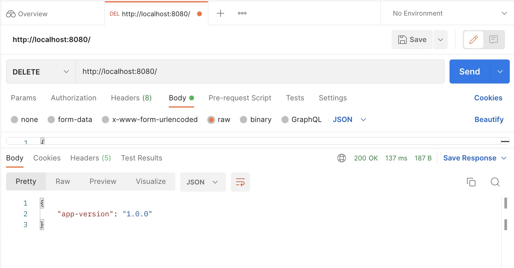
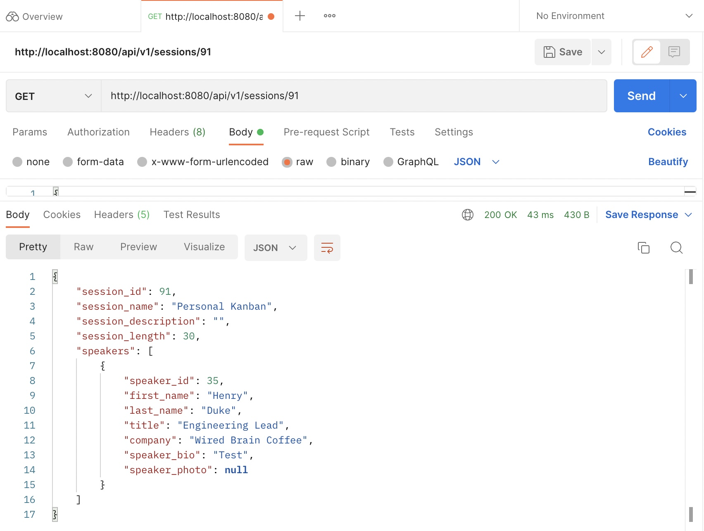
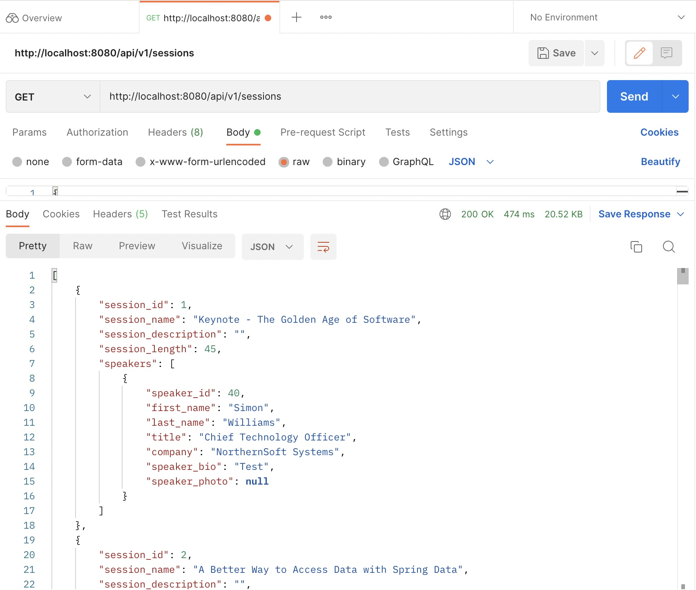

# Spring Conference Demo App

This is a conference microservice app that will just display sessions/speaker info in JSON based on the endpoint url.
supports get/post/delete/put via postman.

guide source:

https://www.pluralsight.com/courses/creating-first-spring-boot-application

### Part 1

create a new spring boilerplate from https://start.spring.io/
or via intellij pro (select spring-boot-starter-web)

### Part 2

create MVC folders for the conference demo app: create a folder for controllers, models, repositories

create the database in postgresql that we will be using.
refer to https://github.com/dlbunker/ps-first-spring-boot-app for the database, tables, and rows.
(personally i had docker running for postgresql)

### Part 3

in the pom.xml file - add the dependencies for postgresql and spring-boot-starter-data-jpa.
Rebuild maven so that it will pull the dependencies.

setup the persistence in intellij ide to the database.

create java classes Session and Speaker under models package

Session and Speaker fields should match the attributes in the database table

Set both Session and Speaker as Entity and add other jpa decorators

Set up Session and Speaker relationship as many-to-many

### Part 4

create SessionRepository and SpeakerRepository that extends JpaRepository

create mapping in SessionsController and SpeakersController for the get/post/put/delete endpoint apis (CRUD)

